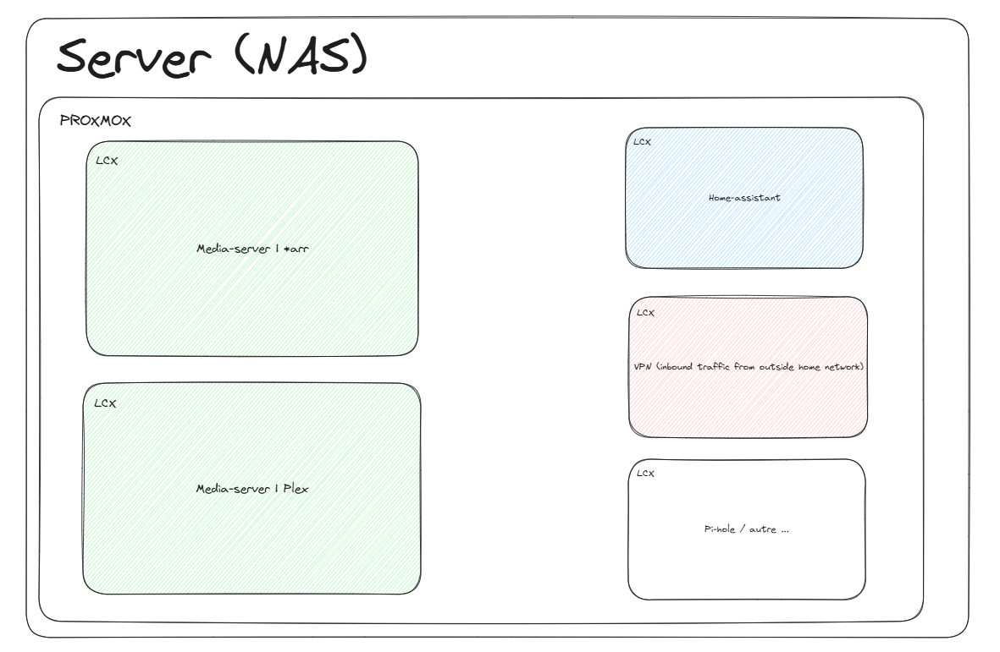
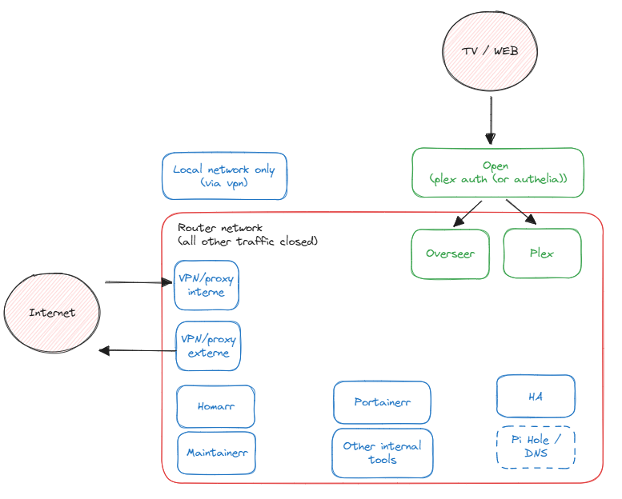

# homelab

My personal Homelab setup.

## Contexte

Homelab that runs Plex, Servarr, Home Assistant and other things, on a NAS/server in my home.  

The setup is made to be entirely automated and customisable. Feel free to use anything from this repo if it helps you. It should be relatively easy for anyone to run a similar setup, by just tweaking the configuration / environment files.  

Built with automation, ease of customisation and a particular focus on security in mind.  
Some services are open to a few poeple of trust (eg: Plex, Overser...) from outside the network.  

### Hardware

- Motherboard: MSI PRO B760M-P
- CPU: Intel i5-14400
- RAM: Crucial pro ram DDR4 16GO (*2)
- SSD: Lexar NM620 SSD 256Go Interne, M.2 2280 PCIe Gen3x4 NVMe
- CPU fan: Be quiet! Pure Rock Slim 2
- PSU: Cooler Master MWE 550 Bronze
- HDD:
  - Seagate Ironwolf red 8TB

### Software

- [home-automation](apps/home-automation/README.md): Home assistant and other home automation
- [immich](apps/immich/README.md): Photo cloud and gallery
- [media-server](apps/media-server/README.md): Media server (Plex and Overseerr)
- [media-management](apps/media-management/README.md): Media download and management (Starr / Servarr stack)
- [reverse-proxy](apps/reverse-proxy/README.md): Entry point, domain, routing and DNS
- [nextcloud](apps/nextcloud/README.md): Cloud
- [vaultwarden](apps/vaultwarden/README.md): Selfhosted Bitwarden
- [vpn](apps/vpn/README.md): VPN to access home network from anywhere
- [vscode-server](apps/vscode-server/README.md): Vscode server

## Architecture

The server runs on Linux Debian, with proxmox ()

### Nas server

### Network

## Setup

### Hardware build

### System install

- debian preseed
- proxmox
- ansible / vagrant for automation

### Software install

