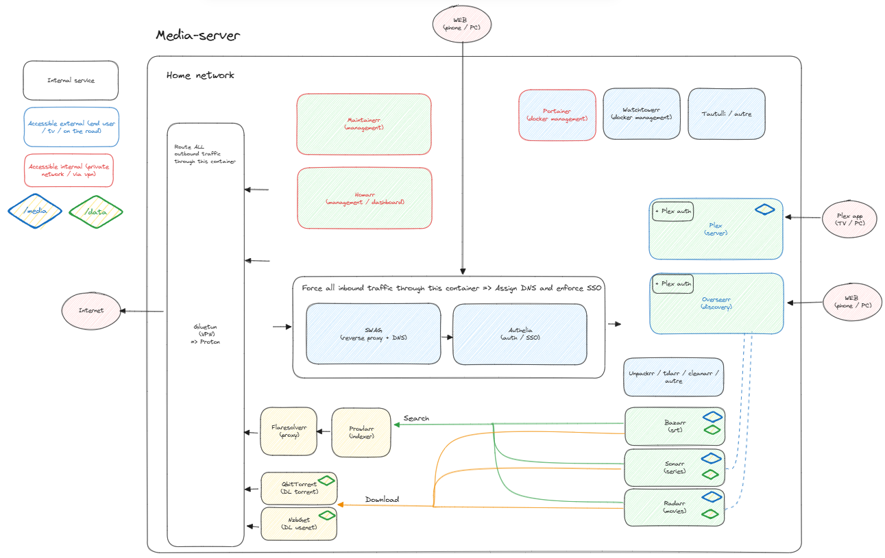

# MEDIA SERVER

## Architecture

## Docs

Mediastack:  

- https://github.com/geekau/mediastack
- https://MediaStack.Guide

Config:  
  
- https://trash-guides.info

Indexer/Downloader:  

- https://fmhy.net/downloadpiracyguide
- torrent:
  - https://fmhy.net/videopiracyguide#torrent-sites
- usenet:
  - https://fmhy.net/downloadpiracyguide#usenet
  - https://docs.google.com/document/d/1TwUrRj982WlWUhrxvMadq6gdH0mPW0CGtHsTOFWprCo/mobilebasic

## Setup

- change config to access ?qbtorrent? interface
- prowlarr: setup sonarr / radarr
- prowlarr: setup indexer
- sonarr: setup client: qbtorrent
- radarr: setup client: qbtorrent
- use correct URLs

## TODO

- gitter les configs
- si db: script sql dans apps/truc a lancer

- setup wireguard / use openvpn conf